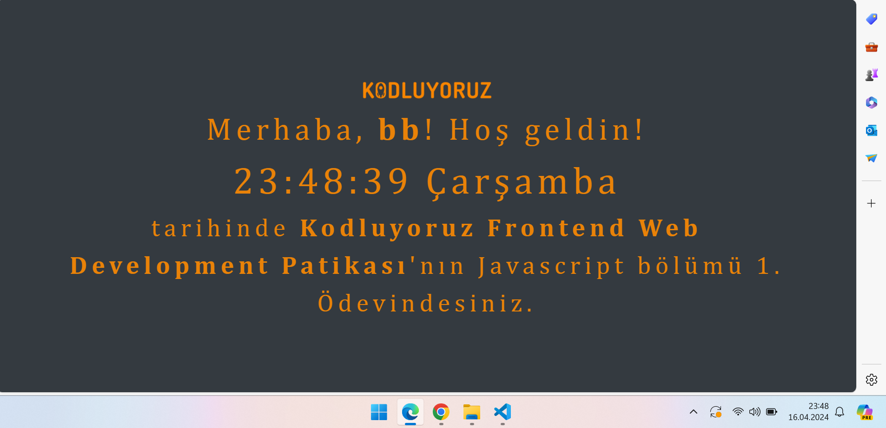

# Clock App
## Live Link: https://main--heroic-fox-1f2ec9.netlify.app/
It is a clock application written in Javascript.

---
### Technologies
- JavaScript
- HTML
- CSS
---
### Features included in the project:
- User's name information was obtained using prompt and printed on the screen
- Time and day information was added to the text
- Time information was updated every second and a countdown was shown on the screen
---
### App Image

---
---

# VETERİNER UYGULAMASI
## Canlı bağlantı: https://main--heroic-fox-1f2ec9.netlify.app/
Javascript ile yazılmış bir saat uygulamasıdır.

---
### Teknolojiler
- JavaScript
- HTML
- CSS
---

### Projede yer alan özellikler:
- Prompt kullanılarak kullanıcan isim bilgisi alındı ve ekrana yazdırıldı
- Metin içerisine saat ve gün bilgisi eklendi
- Saat bilgisinin her saniye güncellenmesi sağlandı ve ekranda geri sayım gösterildi.
